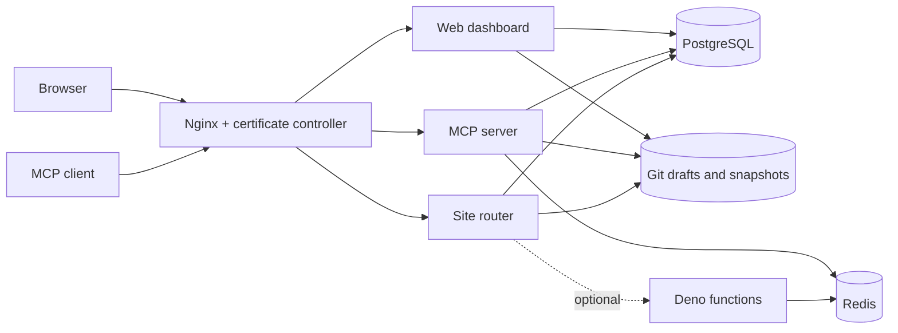

# MCP Static Hosting

Self-hosted website publishing for AI agents. Connect an MCP client, create a site,
edit files, preview the draft, and publish a versioned release on your own server.

[](LICENSE)

**Status: early release, single-server deployments.** Start with trusted users.
This is a new independent project; no existing accounts, data, secrets, domains,
or deployment history are included. See [security boundaries](SECURITY.md).

[Русская инструкция](docs/README.ru.md) · [Deployment](docs/deployment.md) ·
[Production Compose](compose.prod.yaml) · [Configuration](docs/configuration.md) · [MCP](docs/mcp.md) · [Published images](docs/images.md) ·
[Operations](docs/operations.md) · [Contributing](CONTRIBUTING.md)

## Features

- Authenticated Streamable HTTP MCP endpoint for Claude Code, Codex and other clients.
- Dashboard with a locally served Monaco editor and revocable MCP API keys.
- Git-backed drafts, separate preview URLs, immutable published snapshots and rollback.
- Multiple sites per user, subdomain or path hosting, custom domains, optional site passwords.
- Runtime domain configuration: the same Docker image works for different installations.
- Optional experimental Deno functions with project KV, JSON records and encrypted secrets.
- PostgreSQL metadata, Redis, persistent Docker volumes and automatic database migrations.

## Quick start

Requires Docker Engine/Desktop with Docker Compose v2, Git and OpenSSL. Linux x86-64 servers and Docker Desktop with x86-64 emulation are supported. Ports 3000–3002 must be available. No local Node.js,
PostgreSQL, Redis or Deno installation is needed to run the published stack.

```sh
git clone https://github.com/reg2005/mcpStaticHosting.git
cd mcpStaticHosting
sh scripts/setup.sh
docker compose pull
docker compose up -d --wait
```

Open [localhost:3000](http://localhost:3000), create an account and open **MCP tokens**.
Generate a token and copy the client configuration shown by the dashboard.
Example prompt for your agent:

> Create a project called hello, write a simple index.html, show the preview URL,
> then publish it and return its production URL.

The default site domain is `lvh.me`, whose wildcard DNS resolves to the local machine.
Site URLs look like `http://hello-abc12345.lvh.me:3002` and
`http://preview--hello-abc12345.lvh.me:3002`. If your resolver blocks loopback DNS,
add the individual hostnames to your hosts file or configure local wildcard DNS.

Default ports bind to **127.0.0.1**. For a remote server, configure DNS and a TLS
reverse proxy using the [deployment guide](docs/deployment.md). Do not use the
local defaults as a public deployment configuration.

`setup.sh` generates unique secrets in the ignored `.env` file. It never overwrites
an existing configuration. `docker compose down` preserves data; adding `-v` deletes it.

## One domain without a DNS API

Set the following in `.env.production`:

```dotenv
SITE_ROUTING_MODE=path
MAIN_DOMAIN=example.com
ACME_EMAIL=admin@example.com
DNS_PROVIDER=
DNS_CREDENTIALS_PATH=
```

Create **one A record** for `example.com` pointing to the server, open TCP 80/443,
and start the same production Compose. The main certificate uses HTTP-01;
no wildcard record, DNS API key or credentials file is required.

- Dashboard: `https://example.com`
- Published project: `https://example.com/sites/hello-abc12345/`
- Draft: `https://example.com/preview/hello-abc12345/`
- Attached custom domain: `https://adas.com/`, with automatic DNS checking and HTTP-01.

Use relative asset/link URLs or configure your build's base path from the returned
project URL. Arbitrary root-absolute references such as `/assets/app.js` are **not
rewritten**. Path pages run in a browser sandbox to isolate them from the dashboard;
scripts work, but credentialed fetch, storage, cookies and service workers are restricted. Public
assets/modules can be loaded with anonymous CORS.
Use a custom domain for applications needing those browser capabilities. See
[path hosting details](docs/deployment.md#path-hosting-without-a-dns-api).

`SITE_ROUTING_MODE=subdomain` remains the default DNS-01 wildcard mode.

## Production installation

The standalone [compose.prod.yaml](compose.prod.yaml) uses
`reg2005/mcp-static-hosting:0.3.0`, `reg2005/mcp-static-hosting-edge:0.3.0`
and optional `reg2005/mcp-static-hosting-functions:0.3.0`, all for `linux/amd64`.
It contains no builds or installation secrets.

```sh
sh scripts/setup.sh --production
# Set MAIN_DOMAIN, ACME_EMAIL, DNS_PROVIDER in .env.production.
# Create MAIN_DOMAIN / *.MAIN_DOMAIN A records and secrets/dns.env (deployment guide).
sh scripts/compose-prod.sh pull
sh scripts/compose-prod.sh up -d --wait
```

Registration is closed by default in production. Temporarily set
`SIGNUPS_ENABLED=true`, recreate services, register the first trusted account, then
set it back to `false` and recreate services again. Public endpoints must be behind
TLS. The compose wrapper is equivalent to
`docker compose --env-file .env.production -f compose.prod.yaml`.

## Containers

| Image/service | Purpose |
| --- | --- |
| `reg2005/mcp-static-hosting:0.3.0` | Shared image for web, MCP, router and one-shot migrations |
| `reg2005/mcp-static-hosting-edge:0.3.0` | Nginx, DNS checks and automatic certificates |
| `reg2005/mcp-static-hosting-functions:0.3.0` | Optional Deno function runtime |
| `postgres:17-alpine` | Accounts, API keys, projects and release metadata |
| `redis:7-alpine` | Rate limits, function KV and function logs |

The default Compose file pulls prebuilt images and does not build on the server.
Published images target `linux/amd64` (x86-64).
Use a version tag or digest in production. See [release instructions](docs/releases.md).

## Architecture



`apps/web` uses Next.js/React; `apps/mcp` exposes the MCP protocol; `apps/router`
serves files with Hono; `apps/functions` runs optional Deno handlers. Shared auth,
domain logic and schema live in `packages/`. Existing working components were
retained for this extraction; no framework rewrite is required to install it.

This version uses shared filesystem storage on one host. Do not scale writers to
multiple replicas or use it for high-volume transactional JSON records. See the
[architecture decision](docs/adr/0001-independent-compose-distribution.md).

## Build from source

```sh
sh scripts/setup.sh
docker compose -f compose.yaml -f compose.build.yaml build web
docker compose up -d --wait
```

For application development, install Node.js 22 and pnpm 8.6.7:

```sh
corepack enable
pnpm install --frozen-lockfile
pnpm typecheck
pnpm lint
pnpm test
pnpm build
```

The Docker integration test exercises registration, API keys, MCP publishing,
preview isolation, static files and access boundaries. See `scripts/smoke.mjs` and
[Contributing](CONTRIBUTING.md) for the isolated test setup.

## License

[MIT](LICENSE). Dependencies retain their own licenses. See [NOTICE](NOTICE).

## Automatic domains, Nginx and HTTPS

The production stack includes Nginx and a certificate controller. Set `MAIN_DOMAIN`,
`ACME_EMAIL`, `DNS_PROVIDER` in `.env.production`, provide `secrets/dns.env`, and start
[compose.prod.yaml](compose.prod.yaml). Create the initial A records for `MAIN_DOMAIN`
and `*.MAIN_DOMAIN` pointing to your server. Full [installation steps](docs/deployment.md).

- At startup: DNS-01 certificate for `MAIN_DOMAIN` + `*.MAIN_DOMAIN`, with automatic renewal.
- Each project gets a production and preview subdomain; the owner can disable both.
- Custom domains under `MAIN_DOMAIN` are rejected. Other domains show the exact
  instance IPv4 for an A record; DNS is checked periodically and HTTP-01 certificates
  are issued automatically once all A/AAAA records point to this instance.
- `MANAGEMENT_ALLOWED_CIDRS` limits dashboard/authentication/API/MCP access. Empty
  means no IP restriction. Hosted sites remain public. Authentication still applies.

### DNS credentials: five common providers plus Selectel v2

Copy **one** example to
`secrets/dns.env`; use the matching `DNS_PROVIDER` value. Fill empty values with your
provider credentials. Never commit the resulting file. Directory/file permissions
are covered in [deployment](docs/deployment.md#first-installation-with-wildcard-subdomains).

**Cloudflare** — `DNS_PROVIDER=cloudflare`, [example](examples/dns/cloudflare.env.example).
Use a zone-scoped token with Zone:Read and DNS:Edit ([provider docs](https://go-acme.github.io/lego/dns/cloudflare/)).

```dotenv
CF_DNS_API_TOKEN=
```

**AWS Route 53** — `DNS_PROVIDER=route53`, [example](examples/dns/route53.env.example).
Limit IAM permissions to the hosted zone ([provider docs and policy](https://go-acme.github.io/lego/dns/route53/)).

```dotenv
AWS_ACCESS_KEY_ID=
AWS_SECRET_ACCESS_KEY=
AWS_REGION=us-east-1
AWS_HOSTED_ZONE_ID=
```

**DigitalOcean** — `DNS_PROVIDER=digitalocean`, [example](examples/dns/digitalocean.env.example).
Use a token permitted to manage domain records ([provider docs](https://go-acme.github.io/lego/dns/digitalocean/)).

```dotenv
DO_AUTH_TOKEN=
```

**OVH** — `DNS_PROVIDER=ovh`, [example](examples/dns/ovh.env.example).
Restrict the API application to your zone ([provider docs](https://go-acme.github.io/lego/dns/ovh/)).

```dotenv
OVH_ENDPOINT=ovh-eu
OVH_APPLICATION_KEY=
OVH_APPLICATION_SECRET=
OVH_CONSUMER_KEY=
```

**Hetzner** — `DNS_PROVIDER=hetzner`, [example](examples/dns/hetzner.env.example).
Use a DNS token for the project containing the zone ([provider docs](https://go-acme.github.io/lego/dns/hetzner/)).

```dotenv
HETZNER_API_TOKEN=
```

**Selectel v2** — `DNS_PROVIDER=selectelv2`, [example](examples/dns/selectelv2.env.example).
Use a service user, its password, account ID and project UUID ([provider docs](https://go-acme.github.io/lego/dns/selectelv2/)).

```dotenv
SELECTELV2_USERNAME=
SELECTELV2_PASSWORD=
SELECTELV2_ACCOUNT_ID=
SELECTELV2_PROJECT_ID=
```

Other providers from the [lego catalogue](https://go-acme.github.io/lego/dns/) work
through the same credentials file; no provider-specific image build is required.
Interactive `manual` and command-executing `exec` providers are intentionally excluded.
