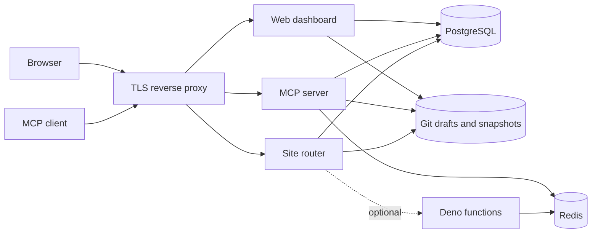

# MCP Static Hosting

Self-hosted website publishing for AI agents. Connect an MCP client, create a site,
edit files, preview the draft, and publish a versioned release on your own server.

[](LICENSE)

**Status: early release, single-server deployments.** Start with trusted users.
This is a new independent project; no existing accounts, data, secrets, domains,
or deployment history are included. See [security boundaries](SECURITY.md).

[Русская инструкция](docs/README.ru.md) · [Deployment](docs/deployment.md) ·
[Configuration](docs/configuration.md) · [MCP](docs/mcp.md) ·
[Operations](docs/operations.md) · [Contributing](CONTRIBUTING.md)

## Features

- Authenticated Streamable HTTP MCP endpoint for Claude Code, Codex and other clients.
- Dashboard with a locally served Monaco editor and revocable MCP API keys.
- Git-backed drafts, separate preview URLs, immutable published snapshots and rollback.
- Multiple sites per user, custom domain mappings, optional site passwords.
- Runtime domain configuration: the same Docker image works for different installations.
- Optional experimental Deno functions with project KV, JSON records and encrypted secrets.
- PostgreSQL metadata, Redis, persistent Docker volumes and automatic database migrations.

> **Image publication pending:** the initial Docker Hub upload has not been completed yet.
> Until image tags are available, use [Build from source](#build-from-source).

## Quick start

Requires Docker Engine/Desktop with Docker Compose v2, Git and OpenSSL. Linux x86-64 servers and Docker Desktop with x86-64 emulation are supported. Ports 3000–3002 must be available. No local Node.js,
PostgreSQL, Redis or Deno installation is needed to run the published stack.

```sh
git clone https://github.com/reg2005/mcpStaticHosting.git
cd mcpStaticHosting
sh scripts/setup.sh
docker compose pull
docker compose up -d --wait
```

Open [localhost:3000](http://localhost:3000), create an account and open **MCP tokens**.
Generate a token and copy the client configuration shown by the dashboard.
Example prompt for your agent:

> Create a project called hello, write a simple index.html, show the preview URL,
> then publish it and return its production URL.

The default site domain is `lvh.me`, whose wildcard DNS resolves to the local machine.
Site URLs look like `http://hello-abc12345.lvh.me:3002` and
`http://hello-abc12345.preview.lvh.me:3002`. If your resolver blocks loopback DNS,
add the individual hostnames to your hosts file or configure local wildcard DNS.

Default ports bind to **127.0.0.1**. For a remote server, configure DNS and a TLS
reverse proxy using the [deployment guide](docs/deployment.md). Do not use the
local defaults as a public deployment configuration.

`setup.sh` generates unique secrets in the ignored `.env` file. It never overwrites
an existing configuration. `docker compose down` preserves data; adding `-v` deletes it.

## Production installation

The standalone [compose.prod.yaml](compose.prod.yaml) uses
`reg2005/mcp-static-hosting:0.1.0` and the optional
`reg2005/mcp-static-hosting-functions:0.1.0`, both for `linux/amd64`.
It contains no builds or installation secrets.

```sh
sh scripts/setup.sh --production
# Edit .env.production: AUTH_BASE_URL, MCP_PUBLIC_URL, PUBLIC_BASE_DOMAIN, EMAIL_FROM.
# Configure DNS and your TLS reverse proxy (see the deployment guide).
sh scripts/compose-prod.sh pull
sh scripts/compose-prod.sh up -d --wait
```

Registration is closed by default in production. Temporarily set
`SIGNUPS_ENABLED=true`, recreate services, register the first trusted account, then
set it back to `false` and recreate services again. Public endpoints must be behind
TLS. The compose wrapper is equivalent to
`docker compose --env-file .env.production -f compose.prod.yaml`.

## Containers

| Image/service | Purpose |
| --- | --- |
| `reg2005/mcp-static-hosting:0.1.0` | Shared image for web, MCP, router and one-shot migrations |
| `reg2005/mcp-static-hosting-functions:0.1.0` | Optional Deno function runtime |
| `postgres:17-alpine` | Accounts, API keys, projects and release metadata |
| `redis:7-alpine` | Rate limits, function KV and function logs |

The default Compose file pulls prebuilt images and does not build on the server.
Check Docker Hub's platform list before deploying to a different CPU architecture.
Use a version tag or digest in production. See [release instructions](docs/releases.md).

## Architecture



`apps/web` uses Next.js/React; `apps/mcp` exposes the MCP protocol; `apps/router`
serves files with Hono; `apps/functions` runs optional Deno handlers. Shared auth,
domain logic and schema live in `packages/`. Existing working components were
retained for this extraction; no framework rewrite is required to install it.

This version uses shared filesystem storage on one host. Do not scale writers to
multiple replicas or use it for high-volume transactional JSON records. See the
[architecture decision](docs/adr/0001-independent-compose-distribution.md).

## Build from source

```sh
sh scripts/setup.sh
docker compose -f compose.yaml -f compose.build.yaml build web
docker compose up -d --wait
```

For application development, install Node.js 22 and pnpm 8.6.7:

```sh
corepack enable
pnpm install --frozen-lockfile
pnpm typecheck
pnpm lint
pnpm test
pnpm build
```

The Docker integration test exercises registration, API keys, MCP publishing,
preview isolation, static files and access boundaries. See `scripts/smoke.mjs` and
[Contributing](CONTRIBUTING.md) for the isolated test setup.

## License

[MIT](LICENSE). Dependencies retain their own licenses. See [NOTICE](NOTICE).
